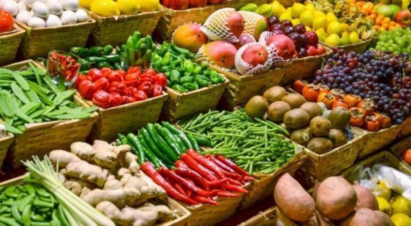
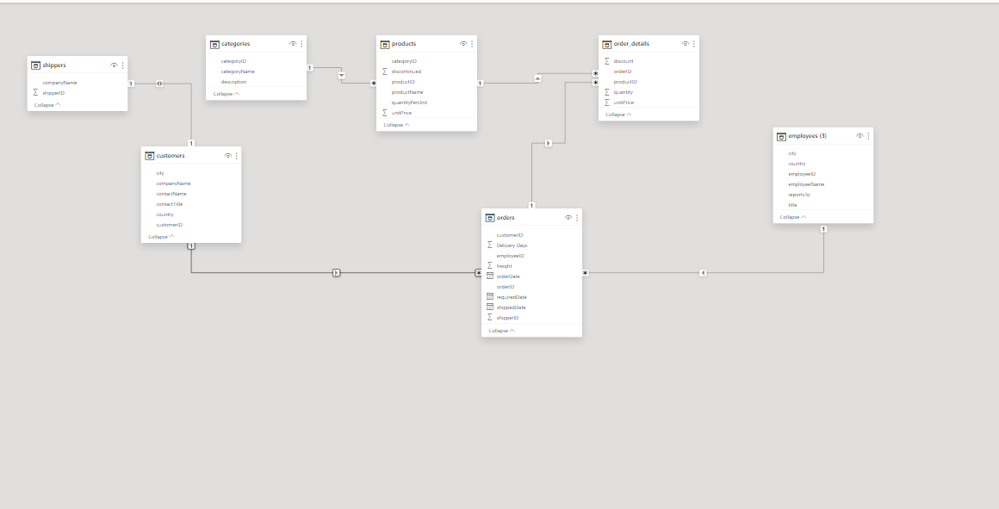
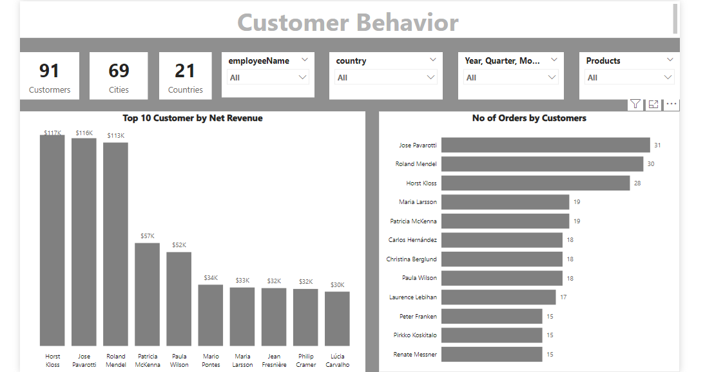
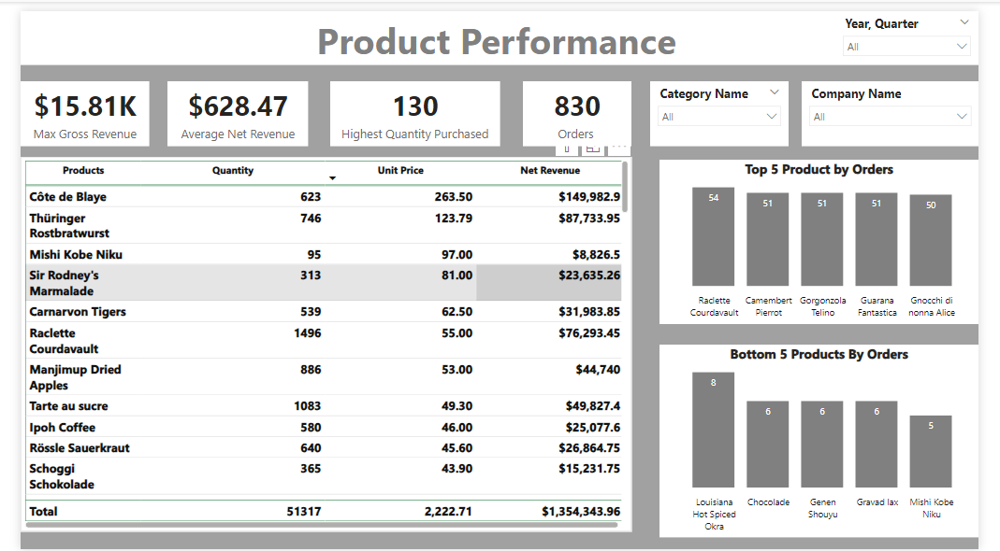

# Introduction
Northwind Traders, a company known for distributing gourmet food product, The Dataset consists of seaven tables and gives us the overview of the company'a activivty between 2013 and 2015, it includes employees data, products data, orders data, shippers data and Customers Data.

## Problem Statement
Northwind Traders, a company known for distributing gourmet food products, wants to make its operations better and decisions smarter in the 2nd half of 2015. To achieve this, the company plans to study its sales data, how customers behave, and how well its products are doing with emphasis on the 1st half of 2015. By doing this, Northwind Traders hopes to find important insights and ways to grow even more.
In their analysis, Northwind Traders wants to look closely at sales trends, how customers buy things, and which products are selling well based on what was achieved in the 1st half of 2015. They believe that by understanding these things better, they can make smarter choices about what to sell and how to sell it. This means they can make sure they have the right products in stock and keep their customers happy.
Northwind Traders knows that using data to make decisions is important. They want to use this information to find ways to make their business better and keep up with what their customers want.

## Data Model

## Data Cleaning and Transformation
1) The Customer Table; I made the front row the as headers
2) Created Gross Revenue Using Custom Coloumn
3)  Created Revenue Revenue Using Custom Coloumn
4)  Checked and Assigned Data Types

## Customer_Behavior Report

## Product_performace Report

1)What makes customers keep coming back, and how can Northwind Traders use this to get more loyal customers?

Exploring the Customer Relation Data, Employees Anne Dodsworth and Nancy Dovolio had an even proportion of customers ,therefore these employees had good commucation and customer service skills henece the  returning customers.

2)Are there certain products that are selling faster than others, and how can Northwind Traders make sure they always have enough of these in stock?
Yes Exploring the data_ set i visualised the top 5 products by orders, Raclette courdavault (54 orders), Camembert Pierrot (51 orders), To always have them in stock , Northwind Traders should restock these products weekly as they are know to sell fast.

3)Do different types of customers buy different things, and how can Northwind Traders use this information to offer products that people want?
Exploring the Product Performance Report, Different Customers buy Different things, Northwind should use the product that generate the highest Net revenue and highest orders.

